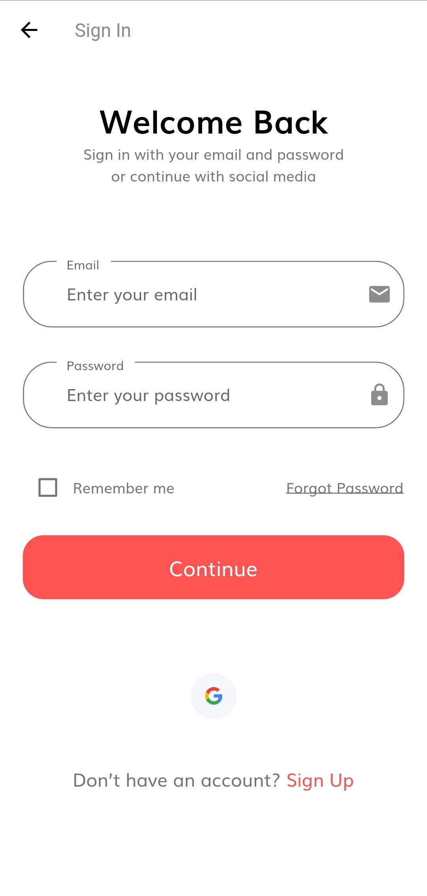
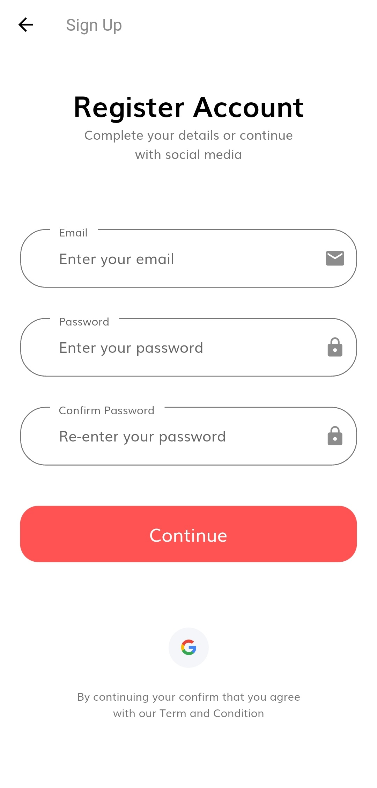
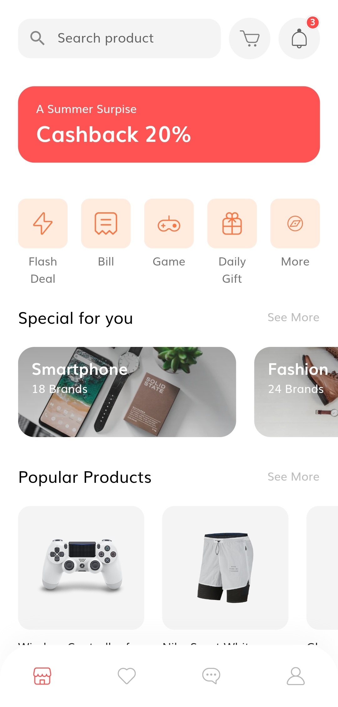
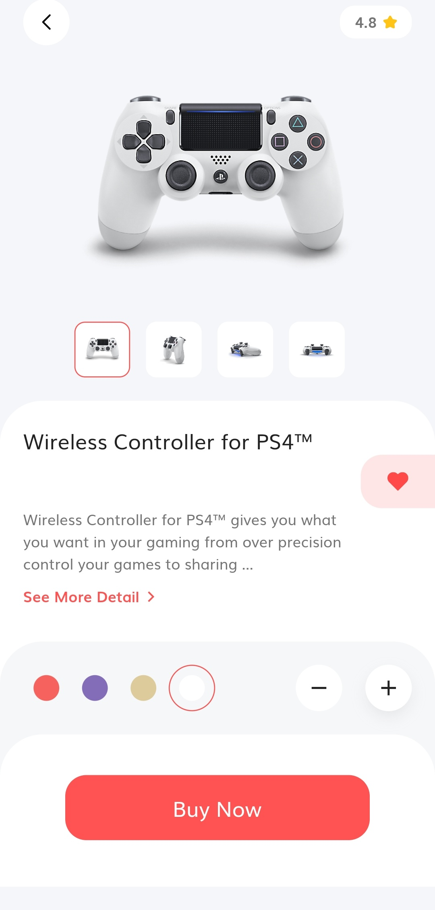
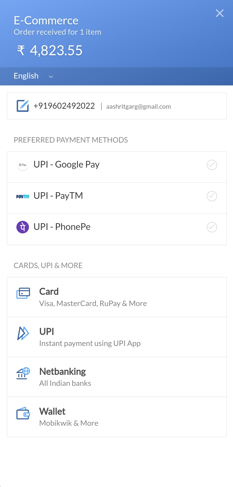

# E-Commerce

An E-Commerce Application for both Android and iOS Users made using Flutter and Firebase.

## Features

 * Clean UI
 * Integration with Firebase
    * Firebase Auth
    * Cloud Firestore
 * Custom Widgets
 * Google Authentication
 * Razorpay Integration (For Payments)
 
## Getting started

#### 1. [Setup Flutter](https://flutter.io/setup/)

#### 2. Clone the repo

```sh
$ git clone https://github.com/Aashrit-Garg/E-Commerce.git
$ cd E-Commerce/
```

#### 3. Setup the firebase app

1. You'll need to create a Firebase instance. Follow the instructions at https://console.firebase.google.com.
2. Once your Firebase instance is created, you'll need to enable anonymous authentication.

* Go to the Firebase Console for your new instance.
* Click "Authentication" in the left-hand menu
* Click the "Sign-in method" tab
* Click "Google" and enable it

4. Enable the Firebase Database
* Go to the Firebase Console
* Click "Firestore Database" in the left-hand menu
* Click the "Create Database" button
* Select "Start in test mode" and "Enable"

5. (skip if not running on Android)

* Create an app within your Firebase instance for Android, with package name com.aashritgarg.ecommerce
* Run the following command to get your SHA-1 key:

```
keytool -exportcert -list -v \
-alias androiddebugkey -keystore ~/.android/debug.keystore
```

* In the Firebase console, in the settings of your Android app, add your SHA-1 key by clicking "Add Fingerprint".
* Follow instructions to download google-services.json
* place `google-services.json` into `/android/app/`.

6. (skip if not running on iOS)

* Create an app within your Firebase instance for iOS, with your app package name
* Follow instructions to download GoogleService-Info.plist
* Open XCode, right click the Runner folder, select the "Add Files to 'Runner'" menu, and select the GoogleService-Info.plist file to add it to /ios/Runner in XCode
* Open /ios/Runner/Info.plist in a text editor. Locate the CFBundleURLSchemes key. The second item in the array value of this key is specific to the Firebase instance. Replace it with the value for REVERSED_CLIENT_ID from GoogleService-Info.plist

Double check install instructions for both
   - Google Auth Plugin
     - https://pub.dartlang.org/packages/firebase_auth
   - Firestore Plugin
     -  https://pub.dartlang.org/packages/cloud_firestore

## Photos





